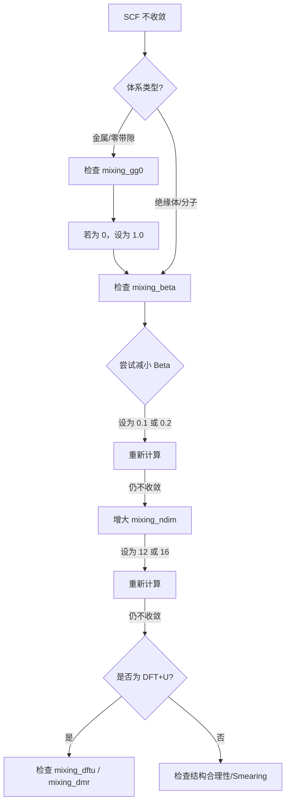

# ABACUS 实战进阶：电荷密度混合与 SCF 收敛调优指南

## 前言

欢迎阅读《ABACUS 实战进阶：电荷密度混合与 SCF 收敛调优指南》。

作为国产第一性原理计算软件的佼佼者，ABACUS 凭借其独特的原子轨道（LCAO）与平面波（PW）双基组优势，在处理大规模体系和高精度计算方面表现出色。然而，在实际科研中，许多用户常被“SCF 不收敛”这一难题困扰。本书的初衷，便是帮助读者从“调参工”转变为“算法调优专家”，攻克计算中最基础也最关键的一环。

### 学习路线图
本书内容由浅入深，分为三个阶段：
- **基础篇（第一章）**：揭开电子自洽迭代（SCF）的“引擎盖”，理解电荷密度混合的物理本质，掌握一套通用的参数配置逻辑。
- **实战篇（第二章）**：针对材料的物理特性（如能隙、金属性、维度）进行定制化调优。你将学会为何宽带隙体系适合高 `mixing_beta`，而金属体系则需要更谨慎的策略。
- **进阶篇（第三章）**：直面磁性、强关联及表面体系等“硬骨头”，通过调控混合历史维度、预处理机制及多物理量协同，解决复杂体系的震荡与收敛极慢问题。

### 知识体系定位
本教程位于 ABACUS 知识体系的中高级进阶层。它不仅仅是关于 `INPUT` 文件的参数说明，更是将密度泛函理论（DFT）的数值实现——特别是 Broyden、Pulay 等混合算法——与具体材料的物理特性相结合的实战指南。它是连接“理论学习”与“高效生产”之间的桥梁。

### 前置知识
在开始本教程之前，我们建议读者已经：
1. 具备基本的固体物理或量子化学基础。
2. 能够独立完成 ABACUS 的基础安装，并成功运行过简单的单点能计算示例。
3. 熟悉 ABACUS 的基本输入文件格式（`INPUT`, `STRU`, `KPT`）。

---

# 第一章：混合算法的物理基础与通用配置

欢迎来到《ABACUS 实战教程》。在开始任何复杂的计算之前，我们必须攻克第一道难关：**电子自洽迭代（SCF）的收敛性**。

很多初学者习惯于直接复制粘贴 `INPUT` 文件中的参数，而不知其所以然。一旦遇到“SCF 不收敛（Not Converged）”的报错，往往束手无策。本章将带你深入 ABACUS 的“引擎盖”下方，理解电荷密度混合（Charge Mixing）的物理本质，并给出一套适用于 80% 场景的通用配置策略。

---

## 1.1 自洽场迭代与不动点问题

密度泛函理论（DFT）的核心在于求解 Kohn-Sham 方程。这是一个非线性问题，因为哈密顿量 $H[\rho]$ 依赖于电荷密度 $\rho$，而电荷密度 $\rho$ 又是由哈密顿量的本征波函数 $\psi$ 决定的。

为了求解这个问题，ABACUS 采用**自洽场（Self-Consistent Field, SCF）迭代**的方法。这个过程可以简化为以下循环：

1.  **猜测**：给出一个初始的输入电荷密度 $\rho_{in}$（通常基于原子电荷叠加）。
2.  **求解**：根据 $\rho_{in}$ 构建势函数 $V_{eff}$，求解薛定谔方程得到波函数 $\psi$。
3.  **输出**：由 $\psi$ 构造出新的输出电荷密度 $\rho_{out}$。
4.  **判断**：比较 $\rho_{in}$ 和 $\rho_{out}$。如果它们足够接近（误差小于 `scf_thr`），则认为**收敛**，计算结束。

### 这里的核心矛盾是什么？
在绝大多数情况下，直接将计算得到的 $\rho_{out}$ 作为下一步的 $\rho_{in}$（即 $\rho_{in}^{(n+1)} = \rho_{out}^{(n)}$）是行不通的。这样做会导致电荷密度在迭代过程中剧烈振荡甚至发散。

**混合算法（Mixing Algorithm）** 的作用，就是利用历史迭代信息，聪明地构造一个新的 $\rho_{in}^{(n+1)}$，使得体系沿着正确的路径滑向基态（Ground State）。从数学上看，这是一个寻找**不动点（Fixed Point）**的问题：找到 $\rho$，使得 $\rho_{out}[\rho] = \rho_{in}[\rho]$。

---

## 1.2 混合算法的选择 (Type)

ABACUS 提供了三种主要的混合算法，通过 `INPUT` 文件中的 `mixing_type` 参数控制。

### 1. **Plain (线性混合)**
- **原理**：最简单的混合方式。新密度是旧密度和输出密度的线性组合。
  $$ \rho_{new} = \rho_{in} + \beta (\rho_{out} - \rho_{in}) $$
- **特点**：稳健但效率极低。
- **适用场景**：仅在其他高级算法全部失效的极端调试情况下使用。

### 2. **Pulay (DIIS)**
- **原理**：直接求逆迭代子空间（DIIS）。利用过去 $N$ 步的历史信息，试图最小化残差向量。
- **特点**：比 Plain 快得多，是许多 DFT 软件的标准算法。

### 3. **Broyden (拟牛顿法) —— 推荐默认值**
- **原理**：通过历史迭代信息近似更新雅可比（Jacobian）矩阵的逆矩阵。它不仅利用了历史电荷密度，还更智能地预测了梯度的方向。
- **特点**：在 ABACUS 中，Broyden 算法通常拥有最快的收敛速度。
- **参数设置**：
  ```bash
  mixing_type  broyden  # 默认值，推荐保持
  ```

> **专家建议**：除非你明确知道自己在做什么，或者遇到了极度病态的收敛问题，否则请始终将 `mixing_type` 保持为 `broyden`。

---

## 1.3 核心步长控制 (Beta)

如果说 `mixing_type` 决定了“走哪个方向”，那么 `mixing_beta` 就决定了“这一步迈多大”。这是混合参数中最敏感、最常调节的参数。

- **参数名**: `mixing_beta`
- **物理含义**: 阻尼因子（Damping factor）。
    - **大 Beta (e.g., 0.7)**: 步子大，收敛快，但容易“迈过头”，导致能量震荡或发散。
    - **小 Beta (e.g., 0.1)**: 步子小，极其稳健，但收敛速度慢，需要更多的迭代步数。

### 速度与稳定性的平衡
`mixing_beta` 仅影响**收敛的路径和速度**，理论上不改变最终收敛后的物理结果（能量、力等）。

- **默认行为**: ABACUS 的默认值通常较为保守（如 0.4 或更低，具体视版本而定），旨在保证稳定性。
- **调节策略**: 
    - 如果 SCF 在 10-20 步内能量单调下降但很慢，可以尝试**增大** `mixing_beta`。
    - 如果 SCF 能量忽高忽低（震荡），必须**减小** `mixing_beta`。

---

## 1.4 实战策略：不同体系的参数预设 (Critical)

这是本章最精华的部分。根据物理体系的电子结构特性（能隙大小、电子屏蔽效应），我们需要采用完全不同的混合策略。

请根据你的计算体系，选择以下对应的参数组合写入 `INPUT` 文件：

### 1. 绝缘体与宽禁带半导体 (Insulators / Semiconductors)
此类体系存在能隙，电子屏蔽效应较弱，电荷密度对势场的变化不敏感，收敛通常很容易。
- **策略**: 激进策略，追求速度。
- **推荐配置**:
  ```bash
  mixing_type      broyden
  mixing_beta      0.7    # 可以较大
  mixing_gg0       0.0    # 不需要 Kerker 预处理
  mixing_ndim      8      # 默认值即可
  ```

### 2. 原子与小分子 (Atoms / Molecules)
孤立体系，通常置于大真空中。
- **策略**: 避免长程静电势的过度修正。
- **推荐配置**:
  ```bash
  mixing_type      broyden
  mixing_beta      0.4    # 中等值
  mixing_gg0       0.0    # 必须为 0！Kerker 在此处通常是负优化
  ```

### 3. 金属体系 (Metals)
**这是最难收敛的类型**。金属没有能隙，费米面附近的电子极易流动，导致长波（小 $q$）电荷密度振荡（Charge Sloshing）。
- **策略**: 必须开启 Kerker Scaling (`mixing_gg0`) 来抑制长波振荡，同时降低步长。
- **推荐配置**:
  ```bash
  mixing_type      broyden
  mixing_beta      0.2    # 必须小！(0.1 ~ 0.3)
  mixing_gg0       1.0    # 开启 Kerker 预处理 (建议从 1.0 或 1.5 开始尝试)
  mixing_ndim      8
  ```
  > **注意**: `mixing_gg0` 的单位是 $Bohr^{-1}$（倒空间波矢）。对于极难收敛的金属，可尝试增大此值。

### 4. 强关联体系 (DFT+U / Hybrid Functionals)
涉及 $d$ 或 $f$ 电子的局域化修正，不仅电荷密度需要混合，密度矩阵（Occupations）也需要稳定。
- **策略**: 开启密度矩阵混合，并利用重启功能。
- **推荐配置**:
  ```bash
  mixing_type      broyden
  mixing_beta      0.3
  mixing_dftu      1      # 开启 DFT+U 的密度矩阵混合
  # mixing_dmr     0.x    # (可选) 某些版本支持调节密度矩阵的混合权重
  ```
  > **技巧**: 对于极难收敛的 DFT+U 计算，可以先做一个普通的 LDA/GGA 计算收敛后，保存电荷密度，再开启 `+U` 并设置 `mixing_restart 1` 读取前一步的混合历史，这能极大提升收敛性。

---

## 1.5 调试流程图：如果不收敛怎么办？

当你在输出文件中看到 `SCF is not converged` 或者能量在最后几步依然剧烈跳动时，请按以下流程进行排查：



### 文字版调试清单
1.  **第一招（降速）**：直接将 `mixing_beta` 减半（例如从 0.4 降到 0.2）。这是最有效的急救措施。
2.  **第二招（增存）**：增大 `mixing_ndim`（例如从 8 改为 12）。让算法利用更多的历史步骤来构建新密度，增加稳定性。
3.  **第三招（金属专用）**：如果是金属体系，确保 `mixing_gg0` 大于 0。如果已经是 1.0 仍不收敛，尝试增大到 1.5。
4.  **第四招（判据检查）**：确认你的 `scf_thr` 设置是否合理。
    - **LCAO 基组**：默认 `scf_thr` 为 `1e-7`。
    - **平面波 (PW) 基组**：默认 `scf_thr` 为 `1e-8`。
    - 如果你手动设置了一个过高精度（如 `1e-12`），物理上可能根本无法达到，导致死循环。

---

## 总结
本章我们建立了对 ABACUS 混合算法的物理直觉。记住，`mixing_beta` 和 `mixing_gg0` 是你手中的油门和方向盘。在下一章中，我们将深入探讨如何通过 `INPUT` 文件进行更精细的参数控制。

# 第二章：基于材料体系的定制化策略

在第一性原理计算的实战中，“一套参数走天下”是最大的误区。ABACUS 作为一款兼具平面波（PW）和原子轨道（LCAO）基组的软件，其自洽场（SCF）收敛行为与材料的电子结构特征紧密相关。

本章是本教程的核心战术部分。我们将抛弃枯燥的参数列表，而是从**能隙（Band Gap）**、**金属丰度（Metallicity）**和**维度（Dimension）**三个维度出发，为你提供分门别类的参数预设策略。

---

## 2.1 宽带隙体系：绝缘体与半导体
**典型代表**：Si, SiO₂, NaCl, 大部分有机分子晶体

对于能隙大于 1 eV 的体系，电子在费米面附近的态密度（DOS）为零或极低。这意味着体系对电荷密度的微小扰动不敏感，不容易发生电荷在不同能级间的剧烈“震荡”。因此，我们可以采取**激进**的混合策略，以减少迭代步数。

### 核心策略
1.  **激进的混合因子 (`mixing_beta`)**：由于体系稳定，我们可以“大步快跑”。
2.  **关闭 Kerker 预处理 (`mixing_gg0`)**：宽带隙体系不需要抑制长波震荡，引入 Kerker 往往不仅无用，反而增加计算开销或导致收敛变慢。

### 推荐参数配置 (INPUT)
```bash
INPUT_PARAMETERS
# ... 其他参数 ...

# 电荷密度混合方法，推荐使用 Pulay 或 Broyden
mixing_type     pulay

# 混合因子 (0.0 ~ 1.0)
# 对于绝缘体/半导体，推荐 0.4 ~ 0.7
mixing_beta     0.7

# Kerker 预处理参数
# 对于非金属体系，必须设为 0 (无量纲)
mixing_gg0      0.0

# 混合历史步数，默认通常够用，难收敛时可调大
mixing_ndim     8
```

> **专家提示**：
> 在 ABACUS 中，`scf_thr`（自洽收敛判据）的默认值取决于基组选择。
> *   **PW 基组**：默认 `1.0e-8` Ry
> *   **LCAO 基组**：默认 `1.0e-7` Ry
> 在进行高精度计算（如声子谱、弹性常数）时，建议显式指定更严格的 `scf_thr`（如 `1.0e-9`）。

---

## 2.2 金属与窄带隙体系：Kerker 预处理的艺术
**典型代表**：Al, Cu, Fe, 石墨烯, 拓扑绝缘体

金属体系的费米面穿过能带，导致费米能级附近存在大量的电子态。在 SCF 迭代初期，输入电势的微小变化会导致电子在费米面附近剧烈重排，产生所谓的**电荷震荡（Charge Sloshing）**。这种震荡在倒空间的长波极限（$G \to 0$）尤为严重，表现为计算迟迟不收敛，能量在两个数值间跳动。

### 核心策略：Kerker Scaling
为了抑制这种震荡，我们需要引入 **Kerker 预处理**。它的物理本质是在倒空间对混合残差进行加权：抑制长波（小 $G$ 矢量）部分的混合，而保留短波（大 $G$ 矢量）部分。

在 ABACUS 中，这一机制通过 `mixing_gg0` 控制。同时，为了配合 Kerker 机制，我们需要显著降低 `mixing_beta`，采用“小步慢跑”的策略。

### 推荐参数配置 (INPUT)
```bash
INPUT_PARAMETERS
# ... 其他参数 ...

mixing_type     pulay

# 混合因子：金属体系必须调小！
# 推荐范围 0.1 ~ 0.3
mixing_beta     0.2

# Kerker 预处理参数 (单位：bohr^-2 左右的量级，具体视实现而定)
# 开启 Kerker 模式，推荐从 1.0 或 1.5 开始尝试
mixing_gg0      1.0  

# 增加历史步数有助于金属体系捕捉复杂的震荡模式
mixing_ndim     10
```

> **实战经验**：
> `mixing_gg0` 没有绝对的“标准值”。如果你发现 SCF 震荡依然剧烈，可以尝试增大该值（如 1.5 或 2.0）；如果收敛极其缓慢但不再震荡，可以适当减小该值或略微增大 `mixing_beta`。

---

## 2.3 孤立体系：原子与分子的特殊陷阱
**典型代表**：孤立的 O 原子, H₂O 分子, 团簇

这是一个新手常犯的错误区域。很多用户在计算孤立原子（特别是过渡金属原子）时，因为看到它们有未填满的电子壳层，就下意识地套用“金属”的参数设置。

**这是错误的。**

### 核心逻辑
孤立体系通常被置于巨大的真空层中。Kerker 预处理的核心是抑制 $G \to 0$ 的电荷变动，而对于孤立体系，长程的静电势变化（对应小 $G$）是物理上真实且必要的。在这些体系中开启 Kerker (`mixing_gg0 > 0`) 往往会导致“负优化”，使电荷密度无法正确弛豫到真空边界，导致收敛停滞。

### 推荐参数配置 (INPUT)
```bash
INPUT_PARAMETERS
# ... 其他参数 ...

# 绝对不要在孤立体系中使用 Kerker
mixing_gg0      0.0

# Beta 值视具体分子的 HOMO-LUMO 间隙而定
# 绝缘分子可设 0.5，开壳层原子/自由基可设 0.2-0.3
mixing_beta     0.5
```

---

## 2.4 强关联体系：DFT+U 与杂化泛函
**典型代表**：过渡金属氧化物 (NiO, CoO), 稀土化合物

当引入 Hubbard U (DFT+U) 或使用杂化泛函（如 HSE06）时，SCF 循环不仅要优化电荷密度，还要优化**密度矩阵（Density Matrix）**或相关的占据数。这引入了额外的非线性。

### 核心策略
除了常规的电荷密度混合，ABACUS 允许对密度矩阵的残差进行控制。对于难以收敛的 +U 计算，以下参数至关重要。

### 关键参数说明
*   **`mixing_dmr`**: 是否对密度矩阵进行混合及加速。在 DFT+U 计算难收敛时，确保此功能处于激活状态或调整相关权重（具体参数名及默认行为请参考最新版官方文档，通常 +U 计算会自动处理，但需留意日志中的 mixing 行为）。
*   **`mixing_restart`**: 如果迭代陷入死循环，定期重置混合历史有时能跳出局部陷阱。

---

## 2.5 总结：如果不收敛怎么办？（实战流程图）

当你在屏幕前看着 `E_Fermi` 或 `dEtot` 上下乱跳时，请按照以下“急救流程”操作：

```mermaid
graph TD
    A[SCF 不收敛] --> B{体系类型?};
    
    B -- 绝缘体/半导体 --> C[检查 mixing_beta];
    C --> C1[减小 beta (如 0.7 -> 0.3)];
    C1 --> D[检查 mixing_ndim];
    
    B -- 金属/窄带隙 --> E[检查 mixing_gg0];
    E --> E1{是否已开启 Kerker?};
    E1 -- No --> E2[设置 mixing_gg0 = 1.0];
    E1 -- Yes --> E3[增大 mixing_gg0 或 减小 beta];
    E3 --> D;
    
    B -- 孤立原子/分子 --> F[确认 mixing_gg0 = 0.0];
    F --> C1;
    
    D --> D1[增大 ndim (如 8 -> 12)];
    D1 --> G{是否为 DFT+U?};
    
    G -- Yes --> H[检查 mixing_dmr / 增加 U 值合理性测试];
    G -- No --> I[检查结构合理性 / Smearing 设置];
```

### 文字版调试速查表

1.  **第一招：降速 (`mixing_beta`)**
    *   无论什么体系，减小 `mixing_beta` 总是最安全的尝试。从 0.7 降到 0.3，甚至 0.1。代价是步数增加，但总比不收敛好。

2.  **第二招：增加记忆 (`mixing_ndim`)**
    *   将 `mixing_ndim` 从默认值增加到 12 或 15。这让算法利用更多的历史信息来预测下一步，对于复杂的电荷震荡（如自旋螺旋体系）非常有效。

3.  **第三招：调节 Kerker (`mixing_gg0`)**
    *   **仅限金属**。如果震荡剧烈，尝试增大 `mixing_gg0` (1.0 -> 1.5)。
    *   **切记**：绝缘体和分子必须保持为 0.0。

4.  **第四招：检查电子温度 (`smearing`)**
    *   (将在后续章节详细讲解) 对于金属，适当提高 `smearing_sigma` (如 0.01 Ry -> 0.02 Ry) 可以平滑费米面附近的占据数分布，显著改善收敛性。

通过本章的策略，你应该能够为 90% 的材料计算任务配置出合理的初始参数。下一章，我们将深入探讨基组的选择——平面波与原子轨道的终极对决。

# 第三章：进阶调试与难收敛体系处理

这是一个关于 ABACUS 软件进阶使用的专业章节。根据您的要求，我将结合计算材料学原理与 ABACUS 的具体实现，撰写这一章节。

---

# 第三章：进阶调试与难收敛体系处理

在上一章中，我们已经成功运行了标准的自洽计算（SCF）。然而，在实际科研中，我们经常会遇到“硬骨头”——电荷密度震荡不减、能量跳变或者收敛极慢。这通常发生在磁性体系、强关联体系、金属表面或者大间隙绝缘体中。

本章将深入 ABACUS 的 SCF 迭代核心，通过精细调控混合（Mixing）算法的历史维度、预处理机制以及多物理量协同混合策略，解决这些难收敛问题。

## 3.1 历史信息的利用与重置 (Dimension & Restart)

ABACUS 默认使用的 `broyden` 混合算法是一种基于“历史”的算法。它不仅利用当前步的输入输出差值，还会回溯过去 $N$ 步的信息，以预测下一步的最佳电荷密度。

### 3.1.1 历史维度：`mixing_ndim`

参数 `mixing_ndim` 决定了算法在内存中保存多少步的历史电荷密度信息。

*   **物理意义**：这就好比开车，`mixing_ndim` 决定了你能通过后视镜看到多远的过去。
    *   **默认值**：`8`。对于大多数简单体系（如 Si, Al）已经足够。
    *   **何时调整**：
        *   **震荡不收敛**：如果 SCF 误差（`drho`）在某个量级（如 1.0e-4）上下震荡，无法继续下降，说明当前的线性预测空间不足以描述复杂的势能面。此时应**增大** `mixing_ndim`（推荐尝试 12, 16, 甚至 20）。
        *   **内存受限**：保存历史步骤需要消耗内存。对于超大体系（数千原子），如果内存吃紧，可以适当**减小**此值，但一般不建议低于 4。

### 3.1.2 历史重置：`mixing_restart`

有时，历史信息反而是一种负担。如果在 SCF 初期，电荷密度发生剧烈变化，或者陷入了错误的局部极小值，早期的历史数据可能会“误导”当前的预测。

*   **策略**：通过 `mixing_restart` 参数，设定每隔多少步清除一次历史信息，强制算法重新构建 Jacobian 矩阵的近似。
*   **典型应用**：在某些极难收敛的磁性体系中，设置 `mixing_restart` 为 0.0 (不重置) 以外的值（例如在某些特定脚本控制下手动重启 SCF）或在计算流程中通过调整 `scf_nmax` 分段计算来间接实现。
    *   *注：在标准 INPUT 中，更常用的手段是当检测到收敛停滞时，停止计算，读取上一步的电荷密度（`init_chg file`）并略微改变混合参数重新开始，这本质上也是一种“保留优秀密度但重置混合历史”的策略。*

---

## 3.2 复杂泛函的特殊混合 (DFT+U & Meta-GGA)

标准的 SCF 混合仅针对**电荷密度（Charge Density, $\rho$）**。但对于某些高级泛函，哈密顿量不仅依赖于 $\rho$，还依赖于其他物理量。如果这些量不参与混合，SCF 就会因为变量不同步而震荡。

### 3.2.1 强关联体系：`mixing_dmr` (DFT+U)

在 DFT+U 计算中，Hubbard $U$ 项引入了对**轨道占据数（Occupation Matrix）**的依赖。

*   **现象**：总电荷密度 $\rho$ 似乎已经收敛，但总能量仍在跳动，或者磁矩在不同轨道间反复横跳。
*   **解决方案**：必须对密度矩阵（Density Matrix）进行混合。
*   **关键参数**：
    *   `mixing_dmr` (或相关布尔开关 `mixing_dftu`): 控制密度矩阵混合的开启与权重。
    *   **建议**：在进行 DFT+U 计算（特别是 f 电子体系或氧化物）时，务必关注此项。如果发现收敛困难，请确保开启了密度矩阵的混合功能。

### 3.2.2 Meta-GGA 体系：`mixing_tau`

Meta-GGA 泛函（如 SCAN, TPSS）依赖于**动能密度（Kinetic Energy Density, $\tau$）**。

*   **关键参数**：`mixing_tau`
*   **用法**：设置为 `1` (True) 开启。
*   **建议**：使用 SCAN 等泛函时，若不开启此选项，SCF 极难收敛。ABACUS 在检测到 Meta-GGA 泛函时通常会自动处理，但在手动调试时需确认此参数状态。

---

## 3.3 体系分类调试策略 (Critical Strategy)

这是本章的核心实战指南。不同物理性质的材料，其最佳混合策略截然不同。请根据你的体系类型，直接参考以下预设：

### 1. 原子与孤立分子 (Atoms & Molecules)
此类体系具有长程库伦作用，且没有费米面附近的屏蔽效应。
*   **核心策略**：**关闭 Kerker 预处理**。
*   **INPUT 推荐**：
    ```bash
    mixing_type     broyden
    mixing_beta     0.4     # 0.3 ~ 0.7 均可
    mixing_gg0      0.0     # 关键！必须设为 0，否则可能负优化
    mixing_ndim     8
    ```

### 2. 绝缘体与半导体 (Insulators & Semiconductors)
有带隙，屏蔽效应有限。
*   **核心策略**：标准参数通常即可，Kerker 预处理效果不明显，可关可不关。
*   **INPUT 推荐**：
    ```bash
    mixing_type     broyden
    mixing_beta     0.7     # 带隙越大，beta 可以越大（收敛越快）
    mixing_gg0      0.0     # 推荐关闭，或保持默认
    ```

### 3. 金属体系 (Metals)
存在费米面，长波（低频）电荷震荡极易导致发散（Charge Sloshing）。
*   **核心策略**：**必须开启 Kerker 预处理**，并降低 Beta。
*   **INPUT 推荐**：
    ```bash
    mixing_type     broyden
    mixing_beta     0.2     # 必须降低！推荐 0.1 ~ 0.3
    mixing_gg0      1.0     # 关键！开启 Kerker 抑制长程震荡
                            # 如果仍不收敛，可尝试增大至 1.5 或 2.0
    mixing_ndim     12      # 金属体系通常需要更多历史信息
    ```

### 4. 复杂磁性/强关联 (DFT+U / Magnetic)
*   **核心策略**：多物理量协同混合，保守迭代。
*   **INPUT 推荐**：
    ```bash
    mixing_type     broyden
    mixing_beta     0.1     # 非常保守的步长
    mixing_ndim     20      # 利用长程历史
    mixing_dmr      1       # (或 mixing_dftu) 开启密度矩阵混合
    scf_thr         1e-6    # 先用低精度收敛，读波函数后再提高精度
    ```

---

<!-- APPENDIX_START -->
## 附录：调试速查表与常见报错

### A.1 "如果不收敛怎么办" 流程图 (Text Version)

当你的 SCF 步数达到 `scf_nmax` 却仍未收敛（`drho` > `scf_thr`）时，请按以下顺序操作：

1.  **Step 1: 检查 `mixing_beta`**
    *   操作：将当前值减半（例如 0.7 -> 0.3）。
    *   原理：步子迈大了容易扯着蛋（震荡），减小步长能增加稳定性。

2.  **Step 2: 检查 `mixing_ndim`**
    *   操作：将当前值增加（例如 8 -> 12）。
    *   原理：利用更多历史数据来构建更准确的势能面。

3.  **Step 3: 体系诊断 (金属 check)**
    *   如果是金属或窄带隙体系：确认 `mixing_gg0 > 0` (推荐 1.0)。
    *   如果是分子/原子：确认 `mixing_gg0 = 0.0`。

4.  **Step 4: 复杂项检查**
    *   如果是 DFT+U：检查是否开启了密度矩阵混合 (`mixing_dmr` / `mixing_dftu`)。
    *   如果是 Meta-GGA：检查 `mixing_tau`。

5.  **Step 5: 终极手段**
    *   改用 `mixing_type pulay`（虽然通常 Broyden 更快，但有时换个算法有奇效）。
    *   检查结构是否合理（原子是否重叠？），这往往是 SCF 跑飞的物理根源。

### A.2 常见陷阱与风险提示

*   **能量大幅震荡（Positive Energy / NaN）**：
    *   通常不是混合参数的问题，而是结构问题（原子距离太近）或赝势截断能（`ecutwfc`）太低。
*   **Kerker 误用的后果**：
    *   在绝缘体中开启强 Kerker (`mixing_gg0` 很大) 会导致极低频的电荷密度无法更新，表现为 `drho` 看起来很小，但总能量收敛极慢甚至错误。
*   **收敛判据的差异 (`scf_thr`)**：
    *   **LCAO 基组**：默认 `scf_thr` 通常为 `1e-7`。
    *   **PW 基组**：默认 `scf_thr` 通常为 `1e-8`。
    *   *注意*：在对比不同基组结果或调试时，请留意这一数量级的差异。
*   **内存消耗**：
    *   `mixing_ndim` 与内存消耗呈线性关系。在几千个原子的大体系 LCAO 计算中，将 `mixing_ndim` 从 8 加到 20 可能会导致 OOM (Out of Memory)。

### A.3 混合参数默认值速查

| 参数名 | 类型 | 默认值 | 物理含义 |
| :--- | :--- | :--- | :--- |
| `mixing_type` | String | `broyden` | 混合算法 (broyden/pulay/plain) |
| `mixing_beta` | Real | 0.8 (nspin=1)<br>0.4 (nspin=2) | 混合步长 (0.0 ~ 1.0) |
| `mixing_ndim` | Int | 8 | 历史步数 |
| `mixing_gg0` | Real | 1.0 | Kerker 预处理强度 (0.0 为关闭) |
| `mixing_tau` | Bool | 0 (False) | 是否混合动能密度 (Meta-GGA) |

---

## 附录：进阶学习指南

恭喜你完成了本书的学习！掌握 SCF 收敛调优只是科研的第一步，计算材料学的世界广阔无垠，鼓励你继续探索以下方向：

### 进阶主题推荐
- **复杂泛函的收敛调控**：当你在使用 Meta-GGA 泛函时，请关注 `mixing_tau` 参数；在涉及强关联体系的 DFT+U 计算中，则需深入理解 `mixing_dftu` 对密度矩阵混合的影响。
- **高性能计算优化**：SCF 的收敛速度不仅取决于算法，还与 `ks_solver` 的选择及并行效率密切相关。尝试对比 `cg` 与 `dav` 算法在不同体系下的表现。
- **长程关联与混合泛函**：对于包含范德华力或需要杂化泛函的体系，收敛逻辑会更加复杂，建议关注 ABACUS 官方发布的最新算例。

### 通用调试策略建议
若遇到收敛困难，请按以下顺序排查：
1. **降低步长**：减小 `mixing_beta`（如从 0.7 降至 0.2 或更低）。
2. **增加历史信息**：适当调大 `mixing_ndim`，利用更多步数的迭代信息来平滑波动。
3. **开启预处理**：对于金属体系，务必尝试开启 Kerker scaling（设置 `mixing_gg0`），这往往是解决长波震荡的灵丹妙药。
4. **检查物理合理性**：如果参数调优无效，请检查 `STRU` 结构是否合理，或者 `smearing_sigma` 是否设置过小。

### 官方资源
- **ABACUS 在线文档**：[https://abacus.deepmodeling.com/](https://abacus.deepmodeling.com/) —— 获取最权威的参数解释。
- **Bohrium 案例库**：搜索 ABACUS 相关 Notebook，获取更多真实材料的计算模板。

科学探索永无止境，愿你的每一次 `Converged` 都能通向伟大的发现！
