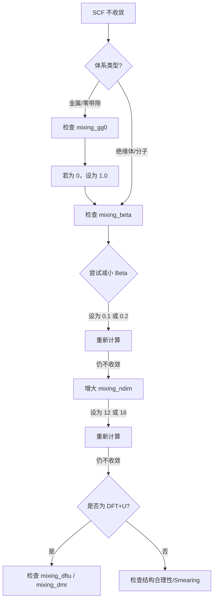

# 第一章：混合算法的物理基础与通用配置

欢迎来到《ABACUS 实战教程》。在开始任何复杂的计算之前，我们必须攻克第一道难关：**电子自洽迭代（SCF）的收敛性**。

很多初学者习惯于直接复制粘贴 `INPUT` 文件中的参数，而不知其所以然。一旦遇到“SCF 不收敛（Not Converged）”的报错，往往束手无策。本章将带你深入 ABACUS 的“引擎盖”下方，理解电荷密度混合（Charge Mixing）的物理本质，并给出一套适用于 80% 场景的通用配置策略。

---

## 1.1 自洽场迭代与不动点问题

密度泛函理论（DFT）的核心在于求解 Kohn-Sham 方程。这是一个非线性问题，因为哈密顿量 $H[\rho]$ 依赖于电荷密度 $\rho$，而电荷密度 $\rho$ 又是由哈密顿量的本征波函数 $\psi$ 决定的。

为了求解这个问题，ABACUS 采用**自洽场（Self-Consistent Field, SCF）迭代**的方法。这个过程可以简化为以下循环：

1.  **猜测**：给出一个初始的输入电荷密度 $\rho_{in}$（通常基于原子电荷叠加）。
2.  **求解**：根据 $\rho_{in}$ 构建势函数 $V_{eff}$，求解薛定谔方程得到波函数 $\psi$。
3.  **输出**：由 $\psi$ 构造出新的输出电荷密度 $\rho_{out}$。
4.  **判断**：比较 $\rho_{in}$ 和 $\rho_{out}$。如果它们足够接近（误差小于 `scf_thr`），则认为**收敛**，计算结束。

### 这里的核心矛盾是什么？
在绝大多数情况下，直接将计算得到的 $\rho_{out}$ 作为下一步的 $\rho_{in}$（即 $\rho_{in}^{(n+1)} = \rho_{out}^{(n)}$）是行不通的。这样做会导致电荷密度在迭代过程中剧烈振荡甚至发散。

**混合算法（Mixing Algorithm）** 的作用，就是利用历史迭代信息，聪明地构造一个新的 $\rho_{in}^{(n+1)}$，使得体系沿着正确的路径滑向基态（Ground State）。从数学上看，这是一个寻找**不动点（Fixed Point）**的问题：找到 $\rho$，使得 $\rho_{out}[\rho] = \rho_{in}[\rho]$。

---

## 1.2 混合算法的选择 (Type)

ABACUS 提供了三种主要的混合算法，通过 `INPUT` 文件中的 `mixing_type` 参数控制。

### 1. **Plain (线性混合)**
- **原理**：最简单的混合方式。新密度是旧密度和输出密度的线性组合。
  $$ \rho_{new} = \rho_{in} + \beta (\rho_{out} - \rho_{in}) $$
- **特点**：稳健但效率极低。
- **适用场景**：仅在其他高级算法全部失效的极端调试情况下使用。

### 2. **Pulay (DIIS)**
- **原理**：直接求逆迭代子空间（DIIS）。利用过去 $N$ 步的历史信息，试图最小化残差向量。
- **特点**：比 Plain 快得多，是许多 DFT 软件的标准算法。

### 3. **Broyden (拟牛顿法) —— 推荐默认值**
- **原理**：通过历史迭代信息近似更新雅可比（Jacobian）矩阵的逆矩阵。它不仅利用了历史电荷密度，还更智能地预测了梯度的方向。
- **特点**：在 ABACUS 中，Broyden 算法通常拥有最快的收敛速度。
- **参数设置**：
  ```bash
  mixing_type  broyden  # 默认值，推荐保持
  ```

> **专家建议**：除非你明确知道自己在做什么，或者遇到了极度病态的收敛问题，否则请始终将 `mixing_type` 保持为 `broyden`。

---

## 1.3 核心步长控制 (Beta)

如果说 `mixing_type` 决定了“走哪个方向”，那么 `mixing_beta` 就决定了“这一步迈多大”。这是混合参数中最敏感、最常调节的参数。

- **参数名**: `mixing_beta`
- **物理含义**: 阻尼因子（Damping factor）。
    - **大 Beta (e.g., 0.7)**: 步子大，收敛快，但容易“迈过头”，导致能量震荡或发散。
    - **小 Beta (e.g., 0.1)**: 步子小，极其稳健，但收敛速度慢，需要更多的迭代步数。

### 速度与稳定性的平衡
`mixing_beta` 仅影响**收敛的路径和速度**，理论上不改变最终收敛后的物理结果（能量、力等）。

- **默认行为**: ABACUS 的默认值通常较为保守（如 0.4 或更低，具体视版本而定），旨在保证稳定性。
- **调节策略**: 
    - 如果 SCF 在 10-20 步内能量单调下降但很慢，可以尝试**增大** `mixing_beta`。
    - 如果 SCF 能量忽高忽低（震荡），必须**减小** `mixing_beta`。

---

## 1.4 实战策略：不同体系的参数预设 (Critical)

这是本章最精华的部分。根据物理体系的电子结构特性（能隙大小、电子屏蔽效应），我们需要采用完全不同的混合策略。

请根据你的计算体系，选择以下对应的参数组合写入 `INPUT` 文件：

### 1. 绝缘体与宽禁带半导体 (Insulators / Semiconductors)
此类体系存在能隙，电子屏蔽效应较弱，电荷密度对势场的变化不敏感，收敛通常很容易。
- **策略**: 激进策略，追求速度。
- **推荐配置**:
  ```bash
  mixing_type      broyden
  mixing_beta      0.7    # 可以较大
  mixing_gg0       0.0    # 不需要 Kerker 预处理
  mixing_ndim      8      # 默认值即可
  ```

### 2. 原子与小分子 (Atoms / Molecules)
孤立体系，通常置于大真空中。
- **策略**: 避免长程静电势的过度修正。
- **推荐配置**:
  ```bash
  mixing_type      broyden
  mixing_beta      0.4    # 中等值
  mixing_gg0       0.0    # 必须为 0！Kerker 在此处通常是负优化
  ```

### 3. 金属体系 (Metals)
**这是最难收敛的类型**。金属没有能隙，费米面附近的电子极易流动，导致长波（小 $q$）电荷密度振荡（Charge Sloshing）。
- **策略**: 必须开启 Kerker Scaling (`mixing_gg0`) 来抑制长波振荡，同时降低步长。
- **推荐配置**:
  ```bash
  mixing_type      broyden
  mixing_beta      0.2    # 必须小！(0.1 ~ 0.3)
  mixing_gg0       1.0    # 开启 Kerker 预处理 (建议从 1.0 或 1.5 开始尝试)
  mixing_ndim      8
  ```
  > **注意**: `mixing_gg0` 的单位是 $Bohr^{-1}$（倒空间波矢）。对于极难收敛的金属，可尝试增大此值。

### 4. 强关联体系 (DFT+U / Hybrid Functionals)
涉及 $d$ 或 $f$ 电子的局域化修正，不仅电荷密度需要混合，密度矩阵（Occupations）也需要稳定。
- **策略**: 开启密度矩阵混合，并利用重启功能。
- **推荐配置**:
  ```bash
  mixing_type      broyden
  mixing_beta      0.3
  mixing_dftu      1      # 开启 DFT+U 的密度矩阵混合
  # mixing_dmr     0.x    # (可选) 某些版本支持调节密度矩阵的混合权重
  ```
  > **技巧**: 对于极难收敛的 DFT+U 计算，可以先做一个普通的 LDA/GGA 计算收敛后，保存电荷密度，再开启 `+U` 并设置 `mixing_restart 1` 读取前一步的混合历史，这能极大提升收敛性。

---

## 1.5 调试流程图：如果不收敛怎么办？

当你在输出文件中看到 `SCF is not converged` 或者能量在最后几步依然剧烈跳动时，请按以下流程进行排查：



### 文字版调试清单
1.  **第一招（降速）**：直接将 `mixing_beta` 减半（例如从 0.4 降到 0.2）。这是最有效的急救措施。
2.  **第二招（增存）**：增大 `mixing_ndim`（例如从 8 改为 12）。让算法利用更多的历史步骤来构建新密度，增加稳定性。
3.  **第三招（金属专用）**：如果是金属体系，确保 `mixing_gg0` 大于 0。如果已经是 1.0 仍不收敛，尝试增大到 1.5。
4.  **第四招（判据检查）**：确认你的 `scf_thr` 设置是否合理。
    - **LCAO 基组**：默认 `scf_thr` 为 `1e-7`。
    - **平面波 (PW) 基组**：默认 `scf_thr` 为 `1e-8`。
    - 如果你手动设置了一个过高精度（如 `1e-12`），物理上可能根本无法达到，导致死循环。

---

## 总结
本章我们建立了对 ABACUS 混合算法的物理直觉。记住，`mixing_beta` 和 `mixing_gg0` 是你手中的油门和方向盘。在下一章中，我们将深入探讨如何通过 `INPUT` 文件进行更精细的参数控制。