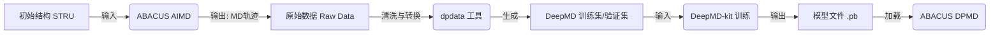

# ABACUS 机器学习势函数开发实战：从数据采样到自动化工作流

## 前言

欢迎来到《ABACUS 机器学习势函数开发实战》。在材料科学迈入“AI for Science”时代的今天，如何结合第一性原理计算的高精度与分子动力学的大尺度模拟，已成为科研人员的必修课。ABACUS（原子算筹）作为国产开源的第一性原理计算软件，凭借其独具特色的数值原子轨道（NAO）基组和高效的并行性能，在生成机器学习所需的高质量数据集方面展现出显著优势。虽然其参数配置对初学者有一定的门槛，但其与 DeepModeling 开源生态的深度整合，使其成为了构建深度势能（Deep Potential）模型的理想“标注引擎”。

**学习路线图**  
本教程旨在为你提供一条从理论到生产的清晰路径：
- **第一章**：梳理物理图像，带你理清从 DFT 到神经网络势函数的本质逻辑，避免混淆生产数据与模型推断的过程。
- **第二章**：实战采样，教你如何利用 ABACUS 运行从头算分子动力学（AIMD），获取力与维里应力等核心标签。
- **第三章**：数据处理，通过 `dpdata` 工具实现从 ABACUS 原始输出到 DeepMD 训练格式的无缝转换。
- **第四章**：流程进阶，介绍如何将 ABACUS 集成至 DP-GEN 主动学习框架，实现势函数开发的自动化迭代。

**知识体系定位**  
本教程位于 ABACUS 应用生态的高阶环节。它不仅要求你掌握基础的密度泛函理论（DFT）计算，更要求你理解如何将静态的单点能计算转化为动态的势能面采样。它是连接微观量子力学计算与宏观材料性质模拟的关键桥梁。

**前置知识**  
在开始之前，我们建议你具备以下基础：
1. 基础的 Linux 命令行操作与 Python 脚本编写能力。
2. 对 DFT 核心概念（如赝势、能量、力、维里）有基本理解。
3. 已初步完成 ABACUS 与 DeepMD-kit 的环境安装。

---

# 第一章：物理原理与工作流综述

欢迎来到《ABACUS 实战教程》。在开始编写任何输入文件之前，我们需要先在脑海中构建清晰的物理图像。

很多初学者在使用 ABACUS 结合 DeepMD-kit 进行机器学习分子动力学（MLMD）研究时，最容易犯的错误不是参数设置不对，而是**混淆了“生产数据”与“使用模型”这两个完全相反的计算过程**。本章将从物理原理出发，梳理整个工作流，确保你迈出的第一步是正确的。

## 1.1 从 DFT 到神经网络势函数

### 1.1.1 为什么要训练模型？
传统的密度泛函理论（DFT）计算精度高，但计算成本随原子数量呈立方级增长（$O(N^3)$）。这使得我们难以用 DFT 直接模拟大尺度（成千上万个原子）或长时间尺度（纳秒级）的动力学过程。

神经网络势函数（NNP）的目标，就是通过机器学习算法，学习 DFT 的势能面（Potential Energy Surface, PES）。一旦训练完成，神经网络能以接近 DFT 的精度，但只需 $O(N)$ 的线性计算成本，预测原子构型的能量和受力。

### 1.1.2 什么是“Label（标签）”？
在监督学习框架下，神经网络需要“标准答案”来指导训练。在材料计算中，这些标准答案由 ABACUS 的 DFT 计算提供。我们将一个原子构型输入 ABACUS，计算出的以下三个物理量即为训练数据的 **Label**：

1.  **能量 (Energy, $E$)**：系统的总能量。
2.  **受力 (Force, $F$)**：每个原子在当前位置受到的赫尔曼-费曼力（Hellmann-Feynman Force）。这是驱动分子动力学演化的核心。
3.  **维里 (Virial, $V$)**：与应力张量（Stress Tensor）直接相关，描述系统晶胞尺寸变化的趋势。

### 1.1.3 势能面（PES）采样的必要性
**模型只能预测它“见过”的物理场景。**
如果你只用晶体的平衡态结构进行训练，模型就无法准确预测高温下的熔化过程或高压下的相变。因此，我们需要通过 **AIMD（从头算分子动力学）** 主动让原子在相空间中“跑”起来，去探索各种扭曲、拉伸、高温、高压下的原子构型。

这个过程被称为 **采样（Sampling）**。采样的质量直接决定了最终模型的泛化能力。

---

## 1.2 数据生成工作流概览

一个典型的 DeepMD 工作流包含四个主要阶段。ABACUS 在其中扮演着“数据生产者”和“模型使用者”的双重角色，请务必区分。

### 1.2.1 数据流向图



### 1.2.2 关键区分：DFT 模式 vs. DP 模式

这是本章最重要的概念，请务必牢记：

#### 🔴 阶段一：数据生成（Data Generation）
*   **任务**：利用量子力学原理计算“标准答案”。
*   **计算成本**：极其昂贵（需要高性能计算集群）。
*   **ABACUS 角色**：**教师**。
*   **关键参数设置**：
    *   `calculation`: `md` (进行分子动力学采样)
    *   `esolver_type`: **必须是 `ks` (Kohn-Sham DFT)**。这是默认值，代表使用密度泛函理论求解。**绝对不能设为 `dp`**，否则你是在用一个未训练的模型去生成数据，这是逻辑死循环。
    *   **输出控制**：必须开启力和应力的计算，否则没有 Label。
        *   `cal_force`: `1`
        *   `cal_stress`: `1`

#### 🔵 阶段二：模型使用（Model Inference）
*   **任务**：利用训练好的模型快速预测性质。
*   **计算成本**：极低。
*   **ABACUS 角色**：**学生**（应用学到的知识）。
*   **关键参数设置**：
    *   `esolver_type`: **必须是 `dp`**。
    *   `pot_file`: 指定训练好的模型文件（如 `graph.pb`）。

### 1.2.3 数据转换与划分 (dpdata)

ABACUS 计算完成后，会生成包含每一步 MD 构型、能量、力和应力的输出文件（通常位于 `OUT.suffix` 目录中）。我们需要使用 `dpdata` Python 库将这些数据转换为 DeepMD-kit 可识别的格式。

**数据划分策略**：
为了防止过拟合，必须将数据集划分为 **训练集 (Training Set)** 和 **验证集 (Validation Set)**。
*   **训练集**：用于更新神经网络参数。
*   **验证集**：不参与训练，仅用于在训练过程中实时评估模型的准确性。

**实战建议**：
通常我们不需要复杂的随机切分脚本，`dpdata` 提供了便捷的方法。例如，对于一条包含 1000 帧的 AIMD 轨迹，我们可以随机抽取 100 帧作为验证集，其余 900 帧作为训练集。

### 1.2.4 目录结构风险提示

在后续章节进行实操时，请注意 ABACUS 的输出目录结构。`dpdata` 在读取 ABACUS 数据时（格式通常称为 `abacus/md`），通常需要指向包含 `INPUT`、`STRU` 以及输出文件夹的**根目录**，或者直接指向输出日志文件。

> **注意**：ABACUS 的输出文件名和目录结构可能会随版本更新微调。在使用 `dpdata` 时，请确保你的 `dpdata` 版本与 ABACUS 输出格式兼容。如果遇到读取错误，请优先检查 `OUT.suffix` 文件夹下的文件是否完整（如 `Running_MD.log` 或力、能量的输出文件）。

---

**本章总结**：
1.  我们训练神经网络是为了获得 $O(N)$ 复杂度的高精度势函数。
2.  训练数据（Label）由 ABACUS 的 DFT 计算提供，包含 $E, F, V$。
3.  **生成数据时**，ABACUS 的 `esolver_type` 必须是 `ks`；**使用模型时**，才是 `dp`。
4.  必须在 INPUT 文件中显式开启 `cal_force` 和 `cal_stress`，否则产生的数据无效。

下一章，我们将进入实战环节，手把手教你配置 ABACUS 进行 AIMD 数据采集。

# 第二章：ABACUS 势能面采样实战

在上一章中，我们完成了 ABACUS 的安装与环境配置。本章我们将进入 DeepMD 势函数训练的核心环节——**数据生成**。

DeepMD 模型的精度上限完全取决于训练数据的质量。如果说神经网络是“大脑”，那么由 ABACUS 生成的从头算分子动力学（AIMD）轨迹就是“教材”。本章将详细讲解如何配置 ABACUS 的 `INPUT` 文件，以运行高精度的 AIMD 模拟，并确保输出包含力（Force）和维里应力（Virial Stress）在内的完整标签数据。

---

## 2.1 启动 AIMD 进行构型采样

为了训练一个能够描述材料在不同温度、不同构型下行为的势函数，我们需要通过分子动力学（MD）来遍历相空间。

### 2.1.1 关键参数配置

在 `INPUT` 文件中，启动 AIMD 的核心参数如下。请务必注意，此时我们是在**生成数据**，因此必须使用 DFT（KS-DFT）作为求解器，而不是使用已经训练好的模型。

**INPUT 文件示例 (MD 部分)**：

```bash
INPUT_PARAMETERS
# ---------------------------
# 1. 计算模式控制
# ---------------------------
calculation     md          # 设定计算类型为分子动力学
esolver_type    ks          # 【关键】使用 Kohn-Sham DFT 求解器。绝对不要设为 dp！

# ---------------------------
# 2. MD 系综与恒温器
# ---------------------------
md_type         nvt         # 系综类型：nvt (正则系综) 或 nve (微正则系综)
md_thermostat   nose-hoover # 恒温器算法 (仅 NVT 需要)
md_nstep        2000        # 采样的总步数
md_dt           1.0         # 时间步长，单位 fs (建议 0.5 - 2.0)

# ---------------------------
# 3. 温度控制 (采样范围)
# ---------------------------
md_tfirst       300         # 初始温度 (K)
md_tlast        300         # 结束温度 (K)
# 提示：为了覆盖更广的相空间，通常需要运行多个不同温度的 MD (如 300K, 600K, 1000K)

# ---------------------------
# 4. 输出频率控制
# ---------------------------
md_dumpfreq     1           # 【关键】每隔多少步输出一次构型信息
md_out_file     1           # 输出 MD 轨迹文件
```

### 2.1.2 参数详解与避坑指南

1.  **`calculation`**: 必须设置为 `md`。如果是进行静态单点能计算（如补充高压下的静态构型），则设置为 `scf`。
2.  **`esolver_type` (核心易错点)**:
    *   **生成数据阶段**: 必须设为 `ks` (默认值) 或 `sdft`。这意味着每一步 MD 的力和能量都是通过求解薛定谔方程（DFT）得到的，这是“真值”。
    *   **使用模型阶段**: 只有在后续使用训练好的 DeepMD 模型进行推理时，才会将其设为 `dp`。**切勿混淆！**
3.  **`md_dumpfreq`**: 建议设置为 `1`。
    *   DFT 计算非常昂贵，每一步的 SCF 自洽都消耗了大量算力。如果设置为 10 或 100，意味着中间计算出的 90% 的高精度数据被丢弃了。为了最大化数据利用率，请务必保留每一步的数据。

---

## 2.2 开启高精度标签输出 (Force & Stress)

DeepMD 的损失函数（Loss Function）通常包含三部分：能量（Energy）、力（Force）和维里（Virial）。默认情况下，ABACUS 可能不会输出应力张量，或者不会将力写入特定的输出格式。

### 2.2.1 强制输出标签

在 `INPUT` 文件中，必须显式开启以下开关：

```bash
INPUT_PARAMETERS
# ... (其他参数)

# ---------------------------
# 标签输出控制
# ---------------------------
cal_force       1           # 【必须】计算并输出原子受力
cal_stress      1           # 【必须】计算并输出晶胞应力 (Virial)
```

### 2.2.2 为什么必须开启 `cal_stress`？

很多初学者认为只有 NPT（恒压）模拟才需要应力，这是错误的。
*   **训练角度**: 即使在 NVT 下采样，晶胞的维里应力张量也包含了原子间相互作用对晶格变形的响应信息。
*   **模型能力**: 如果训练数据中缺乏 Stress 标签，训练出的 DeepMD 模型将**无法准确预测晶格常数、弹性模量或高压相变**。
*   **成本权衡**: 开启 `cal_stress` 会增加少量的计算开销，但对于训练数据的完备性而言，这是绝对值得的。

### 2.2.3 数据输出目录结构

运行完成后，ABACUS 会在 `OUT.${suffix}` 目录下生成数据。对于 `dpdata` 数据转换工具，最关键的目录是 `MD_dump`（或旧版本的类似目录，请以最新文档为准）。

典型的目录结构如下：
```text
Running_Dir/
├── INPUT
├── STRU
├── KPT
├── OUT.my_system/
│   ├── running_md.log
│   └── MD_dump/          <-- dpdata 读取的目标
│       ├── BOX.dat       # 晶胞信息
│       ├── POS.dat       # 坐标信息
│       ├── VEL.dat       # 速度信息
│       ├── FORCE.dat     # 力 (Label)
│       ├── VIRIAL.dat    # 应力 (Label, 需开启 cal_stress)
│       └── ...
```

> **风险提示**: `dpdata` 对 ABACUS 的格式支持依赖于具体的输出文件名。请确保 `cal_force` 和 `cal_stress` 开启后，`MD_dump` 目录下确实生成了 `FORCE.dat` 和 `VIRIAL.dat`。如果缺失，`dpdata` 将无法提取标签。

---

## 2.3 电子结构计算的收敛性控制

在高温 MD（例如 1000K 或 2000K）采样中，原子热运动剧烈，电荷密度震荡严重，极易导致 SCF 不收敛。**未收敛步产生的力和能量是错误的**，这些“噪声数据”一旦进入训练集，会严重破坏模型的精度。

### 2.3.1 增强收敛性的参数策略

建议在 `INPUT` 中针对高温采样进行如下调整：

```bash
INPUT_PARAMETERS
# ... (其他参数)

# ---------------------------
# 电子步收敛控制
# ---------------------------
scf_nmax        100         # 建议增加到 100 或更多 (默认通常为 40-50)
scf_thr         1e-6        # 自洽收敛精度，建议不低于 1e-6 Ry

# ---------------------------
# Smearing (展宽) 设置
# ---------------------------
smearing_method gauss       # 或 mp (Methfessel-Paxton)
smearing_sigma  0.02        # 适当的展宽有助于金属或高温体系收敛 (单位 Ry)

# ---------------------------
# 混合 (Mixing) 设置
# ---------------------------
mixing_type     pulay
mixing_beta     0.4         # 如果不收敛，尝试减小该值 (如 0.2)
```

### 2.3.2 K 点设置 (KPT)

*   **生成数据时**: 必须使用足够密度的 K 点（在 `KPT` 文件中设置）。
    *   虽然 DPMD 模型最终是在实空间运行（类似 Gamma 点），但训练数据的**标签质量**必须基于收敛的 K 点计算。如果使用 Gamma 点采样生成数据，训练出的模型将只能描述 Gamma 点的物理性质，无法准确描述体相材料。
*   **INPUT 关联**: 确保 `basis_type` (如 `lcao` 或 `pw`) 与 `ecutwfc` 设置得当，保证基组层面的收敛。

---

## 2.4 数据集划分策略 (实战建议)

在完成 MD 模拟并获得轨迹后，我们通常使用 `dpdata` 将数据转换为 DeepMD 的 `.npy` 格式。在此阶段，需要注意数据集的划分。

**推荐策略**:
1.  **Shuffle (打乱)**: MD 轨迹具有时间相关性。直接截取前 90% 做训练、后 10% 做验证是不科学的。应当在转换时随机打乱数据。
2.  **划分比例**:
    *   **训练集 (Training Set)**: 用于更新神经网络参数。
    *   **验证集 (Validation Set)**: 用于在训练过程中实时监控过拟合情况。
    *   **示例**: 假设一条轨迹有 2000 帧，可以随机抽取 1800 帧放入 `set.000` (训练)，200 帧放入 `set.001` (验证)。

**总结**:
本章我们完成了 ABACUS 的 `INPUT` 配置，重点在于：
1.  使用 `calculation md` + `esolver_type ks` 运行真值计算。
2.  开启 `cal_force` 和 `cal_stress` 获取完整标签。
3.  通过 `md_dumpfreq 1` 最大化数据产出。

下一章，我们将讲解如何使用 `dpdata` 处理这些原始数据，并正式开始 DeepMD 的训练。

# 第三章：数据清洗与格式转换 (dpdata)

在上一章中，我们成功运行了 ABACUS 的 AIMD（从头算分子动力学）任务，生成了包含原子轨迹、受力和维里（Virial）信息的原始数据。然而，DeepMD-kit 无法直接读取 ABACUS 的原始输出文件。

我们需要一位“翻译官”——**dpdata**。

本章将带你通过 Python 脚本，将 ABACUS 的 DFT 计算结果清洗、打乱并转化为 DeepMD 训练所需的压缩 NumPy 格式（`.npy`）。

---

## 3.1 数据的“翻译”：使用 dpdata 读取 ABACUS 轨迹

`dpdata` 是 DeepModeling 社区开发的一个强大的数据处理库，它能够处理几十种第一性原理软件的格式。对于 ABACUS 用户来说，最常用的类是 `LabeledSystem`，因为它不仅包含结构信息（System），还包含标签信息（Label：即能量、受力和维里）。

### 3.1.1 核心前置检查（Pre-flight Check）

在开始转换之前，请务必确认你的 ABACUS `INPUT` 文件中包含了以下关键设置。如果缺失这些参数，生成的轨迹将不包含训练所需的标签，数据将无法使用：

```bash
# INPUT 文件检查清单
calculation     md      # 必须是分子动力学或弛豫
cal_force       1       # 关键：必须输出受力 (Force)
cal_stress      1       # 关键：必须输出应力/维里 (Virial)
```

> **专家提示**：
> 这里必须严格区分 **DFT 数据生成** 与 **DPMD 模型推理**。
> *   **生成训练数据时**（当前阶段）：`esolver_type` 必须是默认的 `ks` (Kohn-Sham DFT) 或显式指定为 `ksdft`。我们是在用量子力学“教会”神经网络。
> *   **使用模型推理时**（未来阶段）：`esolver_type` 才会设置为 `dp`。
> **切勿在生成训练数据时将 `esolver_type` 设为 `dp`，那是逻辑闭环错误。**

### 3.1.2 读取数据脚本

假设你的 ABACUS MD 任务运行在文件夹 `00.data/abacus_md` 下，且包含 `INPUT`、`STRU` 以及输出目录（通常是 `OUT.ABACUS` 或 `OUT.${suffix}`）。

创建一个 Python 脚本 `convert_data.py`：

```python
import dpdata
import numpy as np

# 1. 指定 ABACUS MD 的路径
# fmt='abacus/md' 告诉 dpdata 这是一个 ABACUS 的 MD 轨迹
# 路径应指向包含 INPUT 和 OUT.xxx 文件夹的根目录
data_path = './00.data/abacus_md'

try:
    # 加载数据
    # type_map 指定原子类型的名称列表，需与 STRU 文件中的顺序一致
    ls = dpdata.LabeledSystem(data_path, fmt='abacus/md', type_map=['Al'])
    
    print(f"成功加载数据！")
    print(f"原子数: {ls.get_natoms()}")
    print(f"帧数: {ls.get_nframes()}")
    
    # 简单检查数据完整性
    if ls.get_nframes() > 0:
        print(f"第一帧能量: {ls['energies'][0]}")
        # 检查是否包含维里 (Virial)
        if 'virials' in ls.data:
            print("维里 (Virial) 数据已检测到。")
        else:
            print("警告：未检测到维里数据，请检查 INPUT 中是否设置了 cal_stress 1")
            
except Exception as e:
    print(f"读取错误: {e}")
    print("请检查路径是否正确，以及 ABACUS 任务是否已生成输出文件。")
```

---

## 3.2 数据集划分策略 (Train/Validation)

机器学习的一条铁律是：**永远不要用考试题来训练学生**。我们需要将数据划分为“训练集”和“验证集”。

### 3.2.1 为什么要随机打乱？

MD 轨迹在时间上是高度相关的（第 $t$ 帧和第 $t+1$ 帧的结构非常相似）。如果我们直接切取前 80% 做训练，后 20% 做验证，模型可能无法在验证集中表现良好，因为验证集的状态可能在训练集中从未出现过（例如温度漂移或发生了相变）。

**最佳实践**：使用随机索引（Random Indexing）抽取验证集。

### 3.2.2 划分脚本实现

在上述脚本的基础上，添加以下代码：

```python
# ... (接上文代码)

# 2. 数据集划分策略
n_frames = ls.get_nframes()
validation_ratio = 0.2  # 20% 的数据用于验证

# 生成随机索引
indexes = np.arange(n_frames)
np.random.shuffle(indexes)

# 计算切分点
n_val = int(n_frames * validation_ratio)
idx_val = indexes[:n_val]      # 验证集索引
idx_train = indexes[n_val:]    # 训练集索引

print(f"训练集帧数: {len(idx_train)}")
print(f"验证集帧数: {len(idx_val)}")

# 使用 sub_system 方法创建子数据集
ts_train = ls.sub_system(idx_train)
ts_val = ls.sub_system(idx_val)
```

---

## 3.3 导出 DeepMD 格式

DeepMD-kit 要求的输入格式是一系列 `.npy` 文件，通常组织在 `set.000`, `set.001` 等文件夹中。`dpdata` 提供了极其便捷的一键导出功能。

### 3.3.1 导出脚本

```python
# ... (接上文代码)

# 3. 导出为 DeepMD 的 npy 格式
# 训练集输出到 training_data 目录
ts_train.to_deepmd_npy('deepmd_data/training_set')

# 验证集输出到 validation_data 目录
ts_val.to_deepmd_npy('deepmd_data/validation_set')

print("数据转换完成！输出目录: ./deepmd_data")
```

### 3.3.2 产物结构解析

运行脚本后，你会看到如下目录结构。理解这些文件对于排查错误至关重要：

```text
deepmd_data/
├── training_set
│   ├── set.000/             # 压缩的数据块
│   │   ├── box.npy          # 晶胞参数 (N_frames, 9)
│   │   ├── coord.npy        # 原子坐标 (N_frames, N_atoms * 3)
│   │   ├── energy.npy       # 体系总能量 (N_frames, 1)
│   │   ├── force.npy        # 原子受力 (N_frames, N_atoms * 3)
│   │   └── virial.npy       # 维里张量 (N_frames, 9)
│   ├── type.raw             # 原子类型索引 (如 0 0 0 1 1 ...)
│   └── type_map.raw         # 原子类型名称 (如 Al Cu)
└── validation_set
    ├── set.000/
    ├── type.raw
    └── type_map.raw
```

> **注意**：
> *   `set.000` 是 DeepMD 的默认分包方式。如果数据量极大，`dpdata` 可能会自动生成 `set.001`, `set.002` 等。
> *   `type.raw` 文件将原子映射为整数（0, 1, 2...），这与 `INPUT` 文件中的 `ntype` 顺序对应。

---

## 常见问题与解决方案 (Troubleshooting)

**Q1: 报错 `KeyError: 'virial'`**
*   **原因**: ABACUS 计算时未开启应力计算。
*   **解决**: 检查 DFT 的 `INPUT` 文件，确保设置了 `cal_stress 1`。如果是弛豫任务（`calculation cell-relax`），通常默认会计算，但 MD 任务必须显式指定。

**Q2: `dpdata` 读取不到数据，显示帧数为 0**
*   **原因**: 路径错误或 ABACUS 尚未输出。
*   **解决**:
    1. 确保 `data_path` 指向的是包含 `INPUT` 文件的**目录**，而不是某个具体文件。
    2. 检查该目录下是否存在 `OUT.${suffix}` 文件夹（例如 `OUT.ABACUS`）。
    3. 确保 `OUT.${suffix}` 内部包含 `Running_MD` (MD任务) 或 `running_cell-relax.log` (弛豫任务) 等日志文件。

**Q3: 混合了多种不同原子数的体系怎么办？**
*   **解决**: DeepMD 要求同一个 system 内原子数量和类型必须一致。如果你有不同原子数的体系（例如一个 64 原子，一个 128 原子），需要将它们分别保存为不同的 `deepmd_data` 子目录（例如 `system_64/` 和 `system_128/`），并在训练时的 json 配置文件中同时指向这两个目录。

完成本章后，你已经拥有了标准的“燃料”。下一章，我们将正式启动引擎，配置并训练你的第一个 Deep Potential 模型。

# 第四章：进阶流程——集成到 DP-GEN

在前面的章节中，我们已经掌握了如何单独运行 ABACUS 进行单点能计算和分子动力学模拟。然而，在构建机器学习势函数（Machine Learning Potential, MLP）的大规模生产环境中，手工提交任务、收集数据、转换格式的效率极低且容易出错。

本章将介绍如何将 ABACUS 作为高精度的**标注引擎（Labeling Engine）**嵌入到 **DP-GEN**（Deep Potential Generator）的并发主动学习工作流中。

---

## 4.1 DP-GEN 中的 ABACUS 接口配置

DP-GEN 的核心控制文件通常命名为 `param.json`。为了让 DP-GEN 识别并正确调用 ABACUS，我们需要在 `fp_params`（First Principles parameters）部分进行特定配置。

### 4.1.1 核心参数解析

以下是一个典型的 `param.json` 片段，展示了如何指定 ABACUS 为计算引擎：

```json
{
    "type_map": ["Si", "C"],
    "mass_map": [28.0855, 12.0107],
    "fp_style": "abacus",
    "fp_task_max": 20,
    "fp_task_min": 5,
    "fp_pp_path": "./PP_ORB",
    "fp_orb_path": "./PP_ORB",
    "fp_params": {
        "ecutwfc": 100,
        "scf_thr": 1e-6,
        "basis_type": "lcao",
        "smearing_method": "gauss",
        "smearing_sigma": 0.002,
        "mixing_type": "pulay",
        "mixing_beta": 0.3,
        "cal_force": 1,
        "cal_stress": 1
    }
}
```

**关键参数详解：**

1.  **`fp_style`: `"abacus"`**
    *   这是告诉 DP-GEN 此时的第一性原理计算引擎是 ABACUS。
2.  **`fp_pp_path` / `fp_orb_path`**
    *   指定赝势（Pseudopotentials）和轨道（Orbitals）文件所在的**绝对路径**或相对路径。DP-GEN 在分发任务时会将这些文件链接到计算目录中。
3.  **`fp_params` 字典**
    *   这里定义的参数会被直接写入 ABACUS 的 `INPUT` 文件中。
    *   **必须包含**：
        *   `cal_force`: `1` —— 计算原子受力（Force），这是训练势函数的核心数据。
        *   `cal_stress`: `1` —— 计算维里应力（Virial Stress）。**这是初学者最容易遗漏的参数**。如果缺失，训练过程中的 Virial Loss 将无法计算，导致模型对晶胞体积变化的预测能力极差。

### 4.1.2 迭代轮次（Stages）

在 `param.json` 的外层，通常还需要定义迭代流程：

```json
"model_devi_jobs": [
    {"sys_idx": [0], "temps": [300], "press": [1.0], "trj_freq": 10, "nsteps": 1000, "ensemble": "nvt", "_idx": "00"},
    {"sys_idx": [0], "temps": [600], "press": [1.0], "trj_freq": 10, "nsteps": 2000, "ensemble": "nvt", "_idx": "01"}
]
```

*   **注意**：这里的 `model_devi_jobs` 定义的是**探索（Exploration）**阶段的参数。通常这个阶段使用 LAMMPS 运行 DPMD 模型。
*   当模型发现“不准确”的构型后，DP-GEN 会自动将其筛选出来，生成 ABACUS 的输入文件（`STRU`, `INPUT`, `KPT` 等），进入 **02.fp (Labeling)** 阶段进行高精度计算。

---

## 4.2 目录结构与文件依赖

自动化流程对文件结构极其敏感。为了确保 ABACUS 在远程集群上能顺利运行，除了 DP-GEN 自动生成的 `STRU` 和 `INPUT` 外，你必须提前准备好静态依赖文件。

### 4.2.1 推荐的目录树

```text
Work_Dir/
├── param.json          # DP-GEN 主配置文件
├── machine.json        # 机器配置（定义如何提交 Slurm/PBS 任务）
├── PP_ORB/             # 存放物理势文件的目录
│   ├── Si_ONCV_PBE-1.0.upf
│   ├── Si_orb_6-31G_1.2mm.orb
│   ├── C_ONCV_PBE-1.0.upf
│   └── C_orb_6-31G_1.2mm.orb
└── init_data/          # 初始训练数据（可选）
    ├── ABACUS_MD_01/
    │   ├── INPUT
    │   ├── STRU
    │   ├── KPT
    │   └── ...
```

### 4.2.2 关键依赖文件说明

1.  **赝势与轨道文件 (`*.upf`, `*.orb`)**
    *   **来源**：必须与 `STRU` 文件中的元素名称严格对应。
    *   **配置**：在 `param.json` 中通过 `fp_pp_path` 指定目录。
    *   **注意**：ABACUS 的 LCAO 基组计算强依赖于 `.orb` 文件，请确保它们与 `.upf` 文件是配套生成的。

2.  **K点设置 (`KPT`)**
    *   **生成机制**：DP-GEN 通常允许在 `param.json` 的 `fp_params` 中指定 `kspacing`（K点间距），从而自动为每个结构生成 `KPT` 文件；或者你可以提供一个通用的模板。
    *   **重要性**：对于金属体系，K点采样密度直接影响能量和力的准确性。

3.  **机器配置 (`machine.json`)**
    *   该文件定义了 ABACUS 具体的执行命令。例如：
    ```json
    "command": "mpirun -np 32 abacus"
    ```
    *   **环境加载**：务必在 `machine.json` 的 `context_type` 或 `prepend_script` 中写入 `module load abacus` 或 `source /path/to/abacus_env.sh`，确保计算节点能找到 ABACUS 可执行程序。

---

## 附录：常见陷阱与调试指南

在将 ABACUS 集成到 DP-GEN 的过程中，以下四个陷阱占据了用户报错的 80%，请务必逐一核查。

### 1. 极易混淆点：DFT 采样 vs DPMD 推理

这是概念上最容易混淆的地方，直接导致计算毫无意义。

*   **场景 A：生成训练数据 (Labeling / FP step)**
    *   **目的**：利用量子力学计算真实的能量、力和应力，作为“标准答案”。
    *   **设置**：`INPUT` 文件中 **`esolver_type` 必须是 `ks`** (默认值) 或显式不写。
    *   **绝对禁止**：在此阶段设置 `esolver_type dp`。如果你这样做了，等于是在用一个未训练好的模型去教它自己（循环论证），产生的数据是垃圾数据。

*   **场景 B：使用模型进行探索 (Exploration / Model Devi step)**
    *   **目的**：利用现有的 DP 模型快速跑 MD，寻找高不确定性构型。
    *   **设置**：通常由 LAMMPS 完成。如果必须用 ABACUS 做推理，此时 `INPUT` 中才设置 `esolver_type dp`。

### 2. 物理量缺失 (Missing Physical Quantities)

*   **症状**：DP-GEN 流程跑通了，但 `dp train` 阶段报错，提示 Virial 维度不匹配或数据全为零。
*   **原因**：ABACUS 默认 **不计算** 应力张量。
*   **解决方案**：
    *   在 `param.json` 的 `fp_params` 中，**必须显式添加**：
        ```text
        cal_stress 1
        cal_force 1
        ```
    *   对于 LCAO 基组，计算应力会显著增加计算耗时，但这是训练 NPT 系综适用势函数的必要代价。

### 3. 数据格式陷阱 (`dpdata` 兼容性)

*   **问题**：ABACUS 版本迭代较快（如 3.2.x 到 3.5.x），输出日志格式可能微调，导致 `dpdata` 无法正则匹配数据。
*   **风险提示**：
    *   DP-GEN 依赖 `dpdata` 库来解析 ABACUS 的输出。
    *   如果遇到 `KeyError` 或解析失败，请优先检查 `dpdata` 是否为最新版。
    *   建议查阅 `dpdata` 官方文档中关于 `abacus/md` 或 `abacus/scf` 格式的说明，确认你的 ABACUS 输出文件名（如 `Running_MD` 或 `MD_dump`）是否符合预期。

### 4. 数据集划分策略

*   **操作建议**：虽然 DP-GEN 的 `00.train` 环节可以自动划分验证集，但在准备初始数据集（`init_data`）时，建议手动进行划分。
*   **最佳实践**：
    *   引用资料建议，将数据集划分为 **训练集 (Training)** 和 **验证集 (Validation)**。
    *   例如：对于一条包含 1000 帧的 AIMD 轨迹，随机抽取 100 帧放入验证集目录，其余 900 帧作为训练集。这能让你在模型训练初期就真实地评估模型的泛化能力，防止过拟合。

### 5. 收敛性检查 (Sanity Check)

*   在将 ABACUS 计算出的数据喂给神经网络之前，建议编写一个简单的 Python 脚本扫描所有 `OUT.*/running_scf.log`。
*   **剔除标准**：如果某一步 SCF 未收敛（`converge` 标志为 false），或者能量出现非物理的巨大跳变（例如单步跳变 > 10 eV/atom），应将其从训练集中剔除，以免污染模型。

---

## 附录：进阶学习指南

恭喜你完成了本教程的核心课程！机器学习势函数的开发是一个不断精进的过程，以下内容将助你进一步探索：

### 1. 进阶探索主题
- **模型压缩（Model Compression）**：在生产环境进行大规模 MD 模拟时，推荐研究 `DP Compress` 技术。根据资料显示，压缩后的模型可以在保持精度的前提下，将模拟效率提升一个数量级。
- **主动学习策略优化**：在第四章的基础上，深入研究 DP-GEN 的配置文件。尝试调整 `trust_level` 参数，探索如何更高效地在相图中搜索“失效构型”，以最少的 DFT 计算量获得最鲁棒的模型。
- **复杂体系采样**：本教程以基础材料为例，进阶读者可尝试固液界面、高压相变或化学反应等复杂体系的采样策略。

### 2. 通用调试建议 (Troubleshooting)
- **数据一致性检查**：使用 `dpdata` 转换后，务必检查训练集中的原子数量与类型是否与 `input.json` 匹配。
- **SCF 收敛问题**：在第二章运行 AIMD 时，若遇到 SCF 不收敛，请检查 `INPUT` 文件中的 `mixing_type` 和 `smearing` 设置，确保每一帧的标签数据都是可靠的。
- **训练损失异常**：若训练 Loss 不下降，优先检查 ABACUS 输出的力（Force）单位是否正确转换为 DeepMD 所需的 eV/Å。

### 3. 推荐资源
- **ABACUS 官方文档**：获取最新的参数说明与数值原子轨道库。
- **DeepModeling 社区**：参与 GitHub 讨论或访问 DeepModeling 开源社区，获取关于 `dpdata` 和 `DP-GEN` 的最新更新。
- **DeepMD-kit 手册**：深入理解神经网络架构（如层数、神经元密度）对模型表现的影响。

科研之路虽长，但工具的革新正让未知的领域变得触手可及。愿你通过本教程，能够构建出精准、高效的深度势能模型！
