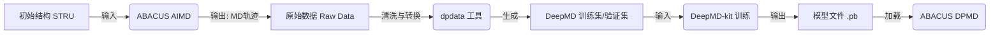

# 第一章：物理原理与工作流综述

欢迎来到《ABACUS 实战教程》。在开始编写任何输入文件之前，我们需要先在脑海中构建清晰的物理图像。

很多初学者在使用 ABACUS 结合 DeepMD-kit 进行机器学习分子动力学（MLMD）研究时，最容易犯的错误不是参数设置不对，而是**混淆了“生产数据”与“使用模型”这两个完全相反的计算过程**。本章将从物理原理出发，梳理整个工作流，确保你迈出的第一步是正确的。

## 1.1 从 DFT 到神经网络势函数

### 1.1.1 为什么要训练模型？
传统的密度泛函理论（DFT）计算精度高，但计算成本随原子数量呈立方级增长（$O(N^3)$）。这使得我们难以用 DFT 直接模拟大尺度（成千上万个原子）或长时间尺度（纳秒级）的动力学过程。

神经网络势函数（NNP）的目标，就是通过机器学习算法，学习 DFT 的势能面（Potential Energy Surface, PES）。一旦训练完成，神经网络能以接近 DFT 的精度，但只需 $O(N)$ 的线性计算成本，预测原子构型的能量和受力。

### 1.1.2 什么是“Label（标签）”？
在监督学习框架下，神经网络需要“标准答案”来指导训练。在材料计算中，这些标准答案由 ABACUS 的 DFT 计算提供。我们将一个原子构型输入 ABACUS，计算出的以下三个物理量即为训练数据的 **Label**：

1.  **能量 (Energy, $E$)**：系统的总能量。
2.  **受力 (Force, $F$)**：每个原子在当前位置受到的赫尔曼-费曼力（Hellmann-Feynman Force）。这是驱动分子动力学演化的核心。
3.  **维里 (Virial, $V$)**：与应力张量（Stress Tensor）直接相关，描述系统晶胞尺寸变化的趋势。

### 1.1.3 势能面（PES）采样的必要性
**模型只能预测它“见过”的物理场景。**
如果你只用晶体的平衡态结构进行训练，模型就无法准确预测高温下的熔化过程或高压下的相变。因此，我们需要通过 **AIMD（从头算分子动力学）** 主动让原子在相空间中“跑”起来，去探索各种扭曲、拉伸、高温、高压下的原子构型。

这个过程被称为 **采样（Sampling）**。采样的质量直接决定了最终模型的泛化能力。

---

## 1.2 数据生成工作流概览

一个典型的 DeepMD 工作流包含四个主要阶段。ABACUS 在其中扮演着“数据生产者”和“模型使用者”的双重角色，请务必区分。

### 1.2.1 数据流向图

### 1.2.2 关键区分：DFT 模式 vs. DP 模式

这是本章最重要的概念，请务必牢记：

#### 🔴 阶段一：数据生成（Data Generation）
*   **任务**：利用量子力学原理计算“标准答案”。
*   **计算成本**：极其昂贵（需要高性能计算集群）。
*   **ABACUS 角色**：**教师**。
*   **关键参数设置**：
    *   `calculation`: `md` (进行分子动力学采样)
    *   `esolver_type`: **必须是 `ks` (Kohn-Sham DFT)**。这是默认值，代表使用密度泛函理论求解。**绝对不能设为 `dp`**，否则你是在用一个未训练的模型去生成数据，这是逻辑死循环。
    *   **输出控制**：必须开启力和应力的计算，否则没有 Label。
        *   `cal_force`: `1`
        *   `cal_stress`: `1`

#### 🔵 阶段二：模型使用（Model Inference）
*   **任务**：利用训练好的模型快速预测性质。
*   **计算成本**：极低。
*   **ABACUS 角色**：**学生**（应用学到的知识）。
*   **关键参数设置**：
    *   `esolver_type`: **必须是 `dp`**。
    *   `pot_file`: 指定训练好的模型文件（如 `graph.pb`）。

### 1.2.3 数据转换与划分 (dpdata)

ABACUS 计算完成后，会生成包含每一步 MD 构型、能量、力和应力的输出文件（通常位于 `OUT.suffix` 目录中）。我们需要使用 `dpdata` Python 库将这些数据转换为 DeepMD-kit 可识别的格式。

**数据划分策略**：
为了防止过拟合，必须将数据集划分为 **训练集 (Training Set)** 和 **验证集 (Validation Set)**。
*   **训练集**：用于更新神经网络参数。
*   **验证集**：不参与训练，仅用于在训练过程中实时评估模型的准确性。

**实战建议**：
通常我们不需要复杂的随机切分脚本，`dpdata` 提供了便捷的方法。例如，对于一条包含 1000 帧的 AIMD 轨迹，我们可以随机抽取 100 帧作为验证集，其余 900 帧作为训练集。

### 1.2.4 目录结构风险提示

在后续章节进行实操时，请注意 ABACUS 的输出目录结构。`dpdata` 在读取 ABACUS 数据时（格式通常称为 `abacus/md`），通常需要指向包含 `INPUT`、`STRU` 以及输出文件夹的**根目录**，或者直接指向输出日志文件。

> **注意**：ABACUS 的输出文件名和目录结构可能会随版本更新微调。在使用 `dpdata` 时，请确保你的 `dpdata` 版本与 ABACUS 输出格式兼容。如果遇到读取错误，请优先检查 `OUT.suffix` 文件夹下的文件是否完整（如 `Running_MD.log` 或力、能量的输出文件）。

---

**本章总结**：
1.  我们训练神经网络是为了获得 $O(N)$ 复杂度的高精度势函数。
2.  训练数据（Label）由 ABACUS 的 DFT 计算提供，包含 $E, F, V$。
3.  **生成数据时**，ABACUS 的 `esolver_type` 必须是 `ks`；**使用模型时**，才是 `dp`。
4.  必须在 INPUT 文件中显式开启 `cal_force` 和 `cal_stress`，否则产生的数据无效。

下一章，我们将进入实战环节，手把手教你配置 ABACUS 进行 AIMD 数据采集。